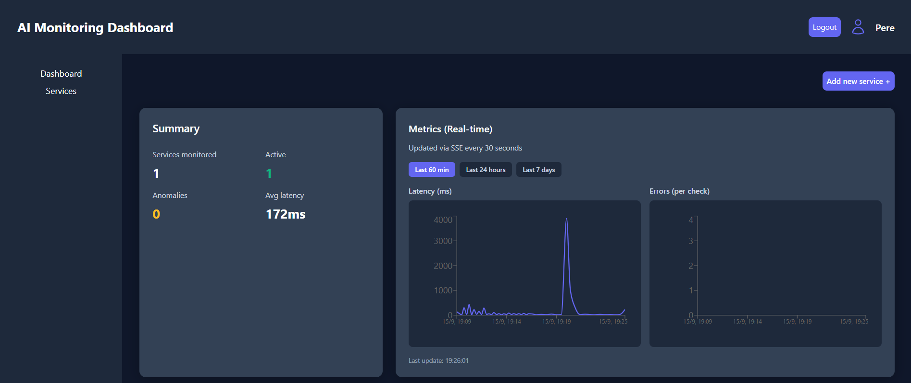
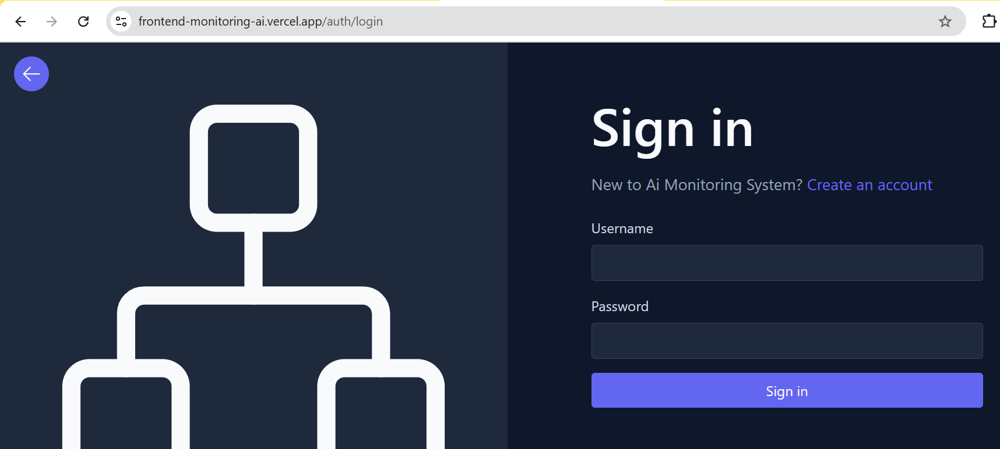
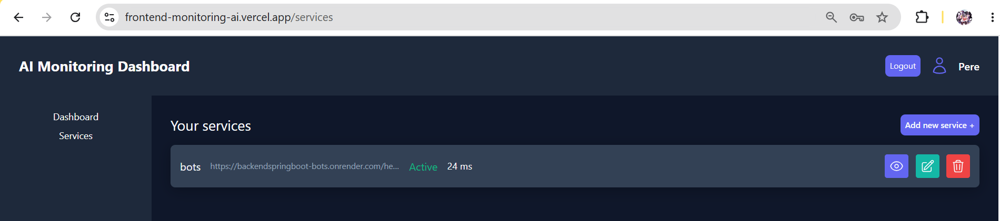
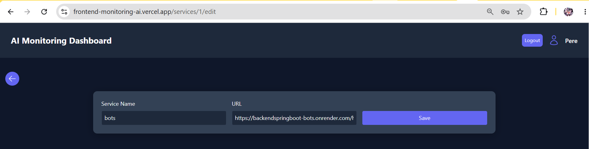

# [English](README.md) | [Español](README.ES.md)

---

<div align="center">

# 🖥️ AI System Monitoring Dashboard — Frontend

**Real-time monitoring dashboard for deployed HTTP services**

[](https://nextjs.org)
[](https://react.dev)
[](https://www.typescriptlang.org)
[](https://tailwindcss.com)
[](https://recharts.org)
[](#)
[](#)


</div>

### 🖼️ Screenshots


### Dashboard




### Auth




### Services







---

## 📖 Table of Contents

- [About](#-about)
- [For Whom](#-for-whom)
- [Key Features](#-key-features)
- [Tech Stack](#-tech-stack)
- [Getting Started](#-getting-started)
- [Usage](#-usage)
- [Environment Variables](#-environment-variables)
- [Project Structure](#-project-structure)
- [Roadmap](#-roadmap)
- [Contributing](#-contributing)
- [License](#-license)

---

## 📌 About

**AI System Monitoring Dashboard — Frontend** is a Next.js client that provides a real-time monitoring UI for deployed HTTP services. It connects to a Spring Boot backend via REST API and Server-Sent Events (SSE) to display live metrics (latency, errors, availability), historical charts with flexible time range selection, and multi-user authentication.

This repository contains only the frontend. For the full-stack project (backend API + frontend), see [BackendMonitoringAi](https://github.com/Dage10/BackendMonitoringAi).

**Live:** [frontend-monitoring-ai.vercel.app](https://frontend-monitoring-ai.vercel.app)

---

## 👥 For Whom

Frontend developers, students, and teams needing a responsive real-time monitoring UI for HTTP services.

---

## ✨ Key Features

| Feature | Description |
|---|---|
| 📊 Real-time dashboard | Live metrics via SSE: latency, errors, uptime % |
| 🔐 Multi-user auth | Register/login with JWT httpOnly cookies |
| 📈 Historical charts | Recharts: latency line, errors bar, availability area |
| ⏱️ Range selector | Last 60 min / Last 24 hours / Last 7 days |
| 📱 Fully responsive | Mobile-first design with hamburger sidebar |
| ⚡ SSE streaming | Real-time push updates without polling |
| 🗃️ Pagination | Services page: 3 items/page with custom pagination |
| 🛡️ Security headers | CSP, X-Frame-Options, XSS-Protection, Referrer-Policy |

---

## 🛠️ Tech Stack

| Layer | Stack |
|---|---|
| Framework | Next.js 16 (App Router) |
| UI | React 19, TypeScript 5 |
| Styling | Tailwind CSS 4 |
| Charts | Recharts 3 (ResponsiveContainer) |
| HTTP | fetch API with credentials |
| SSE | EventSource with auto-reconnect |
| Deploy | Vercel |

---

## 🚀 Getting Started

**Prerequisites:** Node.js 20+, a running backend API

```bash
# Clone
git clone https://github.com/Dage10/FrontendMonitoringAi.git
cd FrontendAiMonitoring/ai-monitoring-dashboard

# Install
npm install

# Configure
cp .env.local.example .env.local
# Edit .env.local with your backend URL

# Run
npm run dev  # http://localhost:3000
```

> **Backend:** See [BackendMonitoringAi](https://github.com/Dage10/BackendMonitoringAi) for API setup.

---

## 💡 Usage

1. **Register** a new account at `/auth/register`
2. **Login** with your credentials
3. **Add services** to monitor (name + health check URL)
4. **View dashboard** — real-time charts update via SSE every 30 seconds
5. **Switch time ranges** — Last 60 min / Last 24 hours / Last 7 days
6. **Check anomalies** — backend flags latency spikes and error rate increases

---

## 🔧 Environment Variables

| Variable | Description | Default |
|---|---|---|
| `NEXT_PUBLIC_API_URL` | API base URL (for SSR/client) | `/api` |
| `API_PROXY_URL` | Backend URL for Next.js API proxy | `http://localhost:8080` |

---

## 📁 Project Structure

```
app/
  (protected)/
    dashboard/page.tsx      # Main dashboard with charts
    services/page.tsx       # Services list with pagination
    services/create/        # Add new service
    services/[id]/edit/     # Edit service
    services/[id]/view/     # View service metrics
  auth/
    login/page.tsx          # Login form
    register/page.tsx       # Register form
  context/AuthContext.tsx   # Auth state management
components/
  Sidebar.tsx              # Responsive sidebar with hamburger
  Header.tsx               # Top header bar
  LatencyChart.tsx         # Recharts LineChart
  ErrorsChart.tsx          # Recharts BarChart
  AvailabilityChart.tsx    # Recharts AreaChart
  RangeSelector.tsx        # Time range picker
  Service.tsx              # Service card component
  LoginRequired.tsx        # Auth gate component
lib/
  api.ts                   # API client (fetch + credentials)
  sse.ts                   # SSE client with auto-reconnect
  auth.ts                  # Auth utilities
  metrics.ts               # Metric types and utilities
```

---

## 🗺️ Roadmap

- [ ] Email/webhook alerts
- [ ] Custom check intervals
- [ ] Service groups & tags
- [ ] User roles (admin/viewer)
- [ ] Dark/light theme toggle
- [ ] CSV export
- [ ] Unit tests

---

## 🤝 Contributing

Fork → branch → commit with [Conventional Commits](https://www.conventionalcommits.org/) → PR. Ensure `npm run lint` and `npm run build` pass.

---

## 📝 License

This project is licensed under the MIT License — see [LICENSE](../LICENSE) for details.

---

<div align="center">

**Built with ❤️ using Next.js, React, and modern 2026 best practices**

</div>
